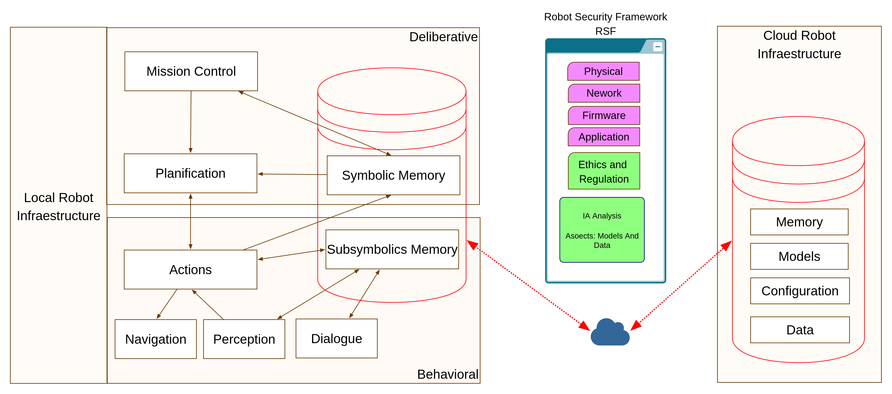

# XRSF: eXtended Robotics Security Framework

The **eXtended Robot Security Framework (XRSF)** is a fork of [aliasrobotics/RSF](https://github.com/aliasrobotics/RSF), adapted to incorporate a structured methodology for analyzing the **cognitive knowledge state** of autonomous robots. This extension bridges the gap between **robotic decision-making**, **explainability**, and **cybersecurity risks**.

## 🧭 Project Goal

XRSF explores and systematizes how autonomous decisions, their traceability, and their impact on the environment can be assessed from a cybersecurity and explainability perspective. It offers a conceptual and practical framework to evaluate decision-making risks in robots through empirical evidence.

## 🔍 Key Contributions

- An explicit connection between these metrics and the concepts of **risk**, **explainability**, and **security**.
- An extended version of RSF, including tools, examples, and data to apply this analysis in simulated or real-world scenarios.

##  Application

The original view presents

In this case we are going to have in mind Cognive architecture and cloud infraestrucure for those cases which are not local. 

- Knowledge Representation Analysis: [10 Criteria](framework/KnowledgeRepresentation.md)

## 📚 Research Context

This work is part of the ongoing project [EDMAR](https://dmarce-project.github.io/):

> **Cybersecurity Challenges in Autonomous Robots: The Link Between Explainability and Decision-Making Risks**

It investigates the connection between observable robot behavior and the security risks that emerge from decisions that are non-transparent, unjustified, or poorly grounded.

-  **Martín, F., Soriano-Salvador, E., Guerrero, J. M., Guardiola Múzquiz, G., Manzanares, J. C., & Rodríguez, F. J.** (2025). *Towards a robotic intrusion prevention system: Combining security and safety in cognitive social robots*. **Robotics and Autonomous Systems**, 104959. [https://doi.org/10.1016/j.robot.2025.104959](https://doi.org/10.1016/j.robot.2025.104959)

-  **Rodríguez Lera, F. J., Pita Lorenzo, Y., Sobrín Hidalgo, D., Fernández Becerra, L., González Fernández, I., & Guerrero Hernández, J. M.** (2025). *Aportes para el cumplimiento del Reglamento (UE) 2024/1689 en robótica y sistemas autónomos*. [arXiv:2503.17730](https://arxiv.org/abs/2503.17730), cs.RO.

## 📁 Repository Structure

- `original/`: Snapshot of the original RSF as reference by Alias Robotics S.L..
- `framework/`: Extended implementation with explainability-focused criteria.

## 🔖 License

This fork retains the original license where applicable. All original contributions are published under a free and compatible license (see `LICENSE` file).

## 🙌 Credits

- Original RSF: [Alias Robotics](https://github.com/aliasrobotics/RSF)
- Extensions: Grupo de Robótica, Universidad de León, Spain.

## 🤝 Project Acknowledgments

DMARCE (EDMAR+CASCAR) Project: EDMAR PID2021-126592OB-C21 -- CASCAR PID2021-126592OB-C22 funded by MCIN/AEI/10.13039/501100011033 and by ERDF A way of making Europe 

